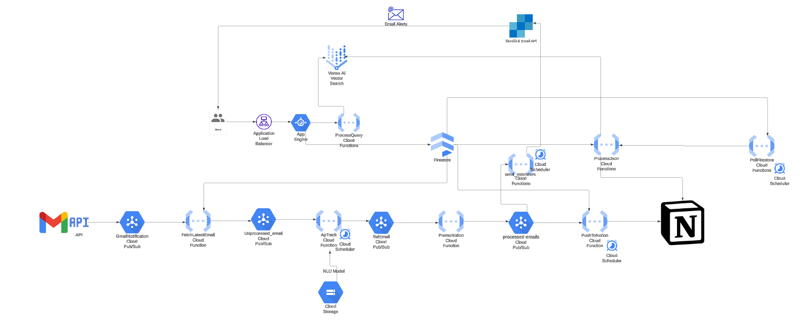
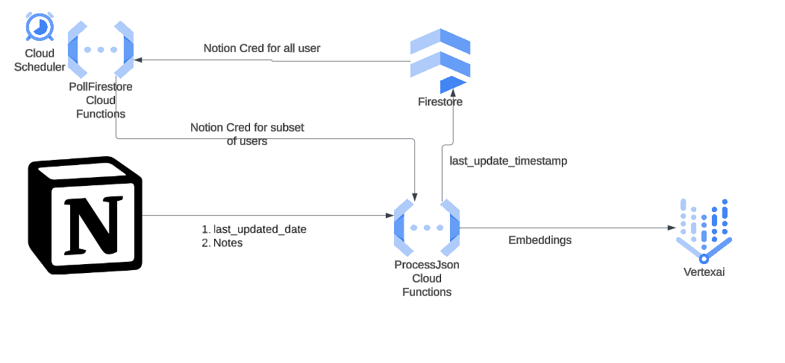
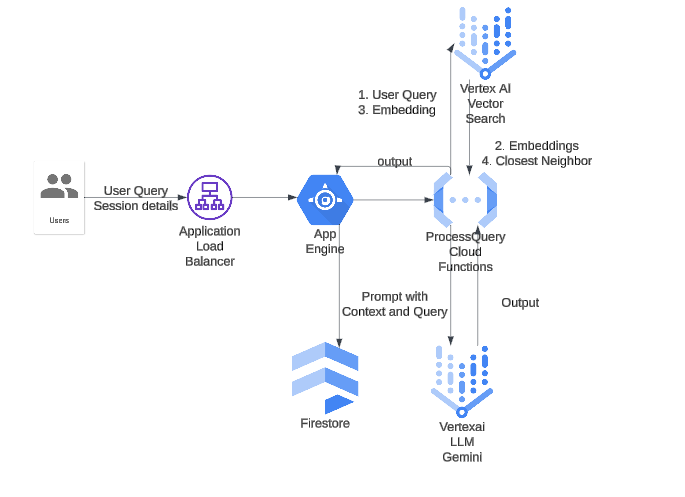
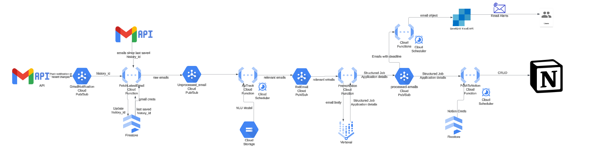

# Talk2Data - Centralized Ecosystem for College Students  

## Overview  
**Talk2Data** is a centralized platform designed to simplify the way college students interact with their academic and professional data. By integrating multiple sources like **Notion** and **Gmail**, the platform organizes critical information for better accessibility and management. With the use of **Retrieval-Augmented Generation (RAG)** and **personalized Large Language Models (LLMs)**, the application offers an intelligent and seamless way to handle class notes and job applications in a single, unified interface.  

## Key Features  
- **Academic Management:** Retrieve, embed, and query notes stored on Notion for a personalized and efficient experience.  
- **Job Application Tracking:** Automate the collection and organization of job-related information from Gmail into a structured Notion database.  
- **Intelligent Querying:** Use VertexAI for embedding data and querying notes with high relevance, ensuring personalized and accurate outputs.  
- **Cloud-Hosted:** The platform is designed for scalability and performance, leveraging serverless functions for data processing.  

---

## Problem Statement  
Managing fragmented data from multiple sources is a persistent challenge for students. This system integrates:  
- **Class Notes**: Pulls user-provided notes from Notion, converts them into embeddings, and generates contextually relevant responses.  
- **Job Applications**: Scans Gmail inboxes for updates like deadlines and interview statuses, and organizes them into a Notion database.  

By centralizing these workflows, Talk2Data enhances productivity and empowers students to focus on their goals.  

---

## Existing Solutions and Limitations  
### Job Application Tracking  
- **Simplify** and similar tools track applications but:  
  - Miss applications submitted outside of the browser.  
  - Lack lifecycle tracking (e.g., assessment, interviews, offers) without manual updates.  

### Retrieval-Augmented Generation for Notes  
- **Reor** is an open-source RAG-based note app but lacks integration with broader ecosystems like job tracking.  

Talk2Data bridges these gaps by offering a holistic and integrated approach for students.  

---

## Architecture  

The system is divided into two primary workflows:  

### 1. **Notes Flow**  

- Tracks changes in Notion pages where students store class notes.  
- Retrieves new/updated data via Notion APIs every 5 minutes.  
- Converts updated data into embeddings using **VertexAI** and stores them for efficient querying.  
- Handles user queries by retrieving relevant notes and formatting outputs via **text-embedding-005** LLM.  

**Optimization:**  
- Uses periodic polling over webhooks to batch-process changes for multiple users efficiently.  
- Serverless functions scale dynamically to handle embedding and querying tasks.  

---

### 2. **Application Tracker**  

- Scans Gmail inbox for job-related updates.  
- Organizes data into Notion databases, tracking deadlines, interviews, and other stages automatically.  

**Setup Requirements:**  
- **Google Authentication:** Users grant permission for Gmail access to track job applications.  
- **Notion Tokens:** Users provide tokens and Page IDs for notes and job application tracking.  

---

## Key Technologies  
- **Retrieval-Augmented Generation (RAG)** for embedding and querying user-specific data.  
- **VertexAI** for generating embeddings.  
- **Notion API** for tracking changes and retrieving user content.  
- **Google APIs** for email access and job application tracking.  
- **Serverless Functions:** Scalable cloud-based processing for retrieval, embedding, and querying.  

---

## How to Use  
### Prerequisites  
- A Gmail account for job application tracking.  
- A Notion account with a setup for class notes and job tracking.  
- Access to Google Cloud Platform and VertexAI for embeddings.

### Steps  
1. Clone this repository.  
2. Configure your environment with your Google API and Notion credentials.  
3. Deploy the serverless functions on a cloud platform of your choice.  
4. Set up periodic triggers for data retrieval and processing.

---

## Future Enhancements  
- Expand beyond Notion and Gmail to integrate with additional platforms like Slack and Outlook.  
- Add support for more advanced lifecycle tracking in job applications.  
- Provide customizable dashboards for users to visualize academic and job-related insights.  

---

## Contributors  
- **Sitanshu Kushwaha** 
- **Sanchit Sahay**  
- **Neel Gandhi**  
- **Kevin Vaishnav**  
 

For questions or contributions, feel free to reach out to us at:  
`{sak9813, ss19723, njg9191, knv2014}@nyu.edu`

---  

## Acknowledgments  
We acknowledge the efforts of the NYU community and our mentors for guiding us through this project. Special thanks to Google Cloud and Notion for their APIs, which made this platform possible.  
